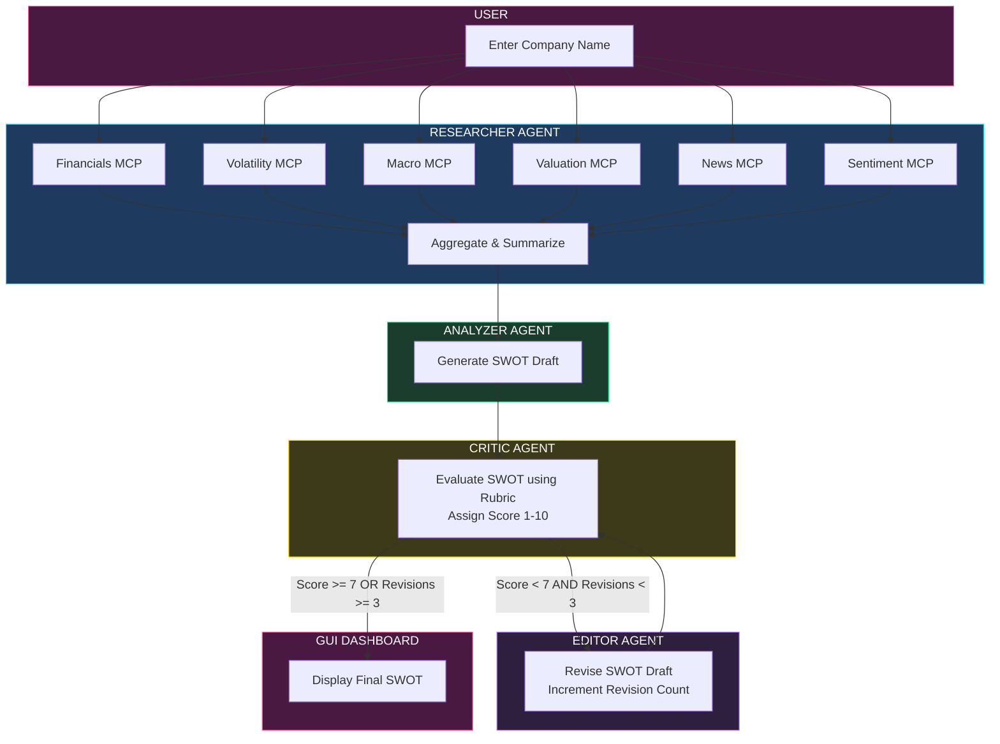
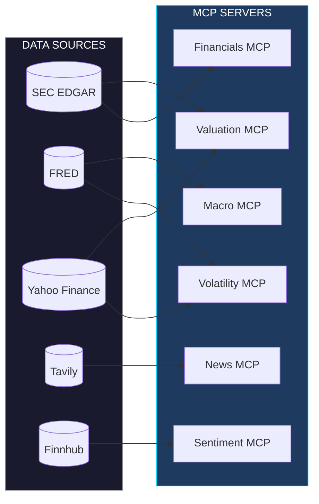

# AI Strategy Copilot - Process Flow

## Main Workflow

```mermaid
flowchart TD
    subgraph USER["USER"]
        A[Enter Company Name]
    end

    subgraph RESEARCHER["RESEARCHER AGENT"]
        C1[Financials MCP]
        C2[Volatility MCP]
        C3[Macro MCP]
        C4[Valuation MCP]
        C5[News MCP]
        C6[Sentiment MCP]
        C7[Aggregate & Summarize]
    end

    subgraph ANALYZER["ANALYZER AGENT"]
        D[Generate SWOT Draft]
    end

    subgraph CRITIC["CRITIC AGENT"]
        E[Evaluate SWOT using Rubric<br/>Assign Score 1-10]
    end

    subgraph EDITOR["EDITOR AGENT"]
        F[Revise SWOT Draft<br/>Increment Revision Count]
    end

    subgraph OUTPUT["GUI DASHBOARD"]
        H[Display Final SWOT]
    end

    A --> C1 & C2 & C3 & C4 & C5 & C6
    C1 & C2 & C3 & C4 & C5 & C6 --> C7
    C7 --> D
    D --> E
    E -->|"Score < 7 AND Revisions < 3"| F
    F --> E
    E -->|"Score >= 7 OR Revisions >= 3"| H

    style USER fill:#4a1942,stroke:#ff6b9d,color:#fff
    style RESEARCHER fill:#1e3a5f,stroke:#00d4ff,color:#fff
    style ANALYZER fill:#1a3d2e,stroke:#00ff88,color:#fff
    style CRITIC fill:#3d3a1a,stroke:#ffd700,color:#fff
    style EDITOR fill:#2d1f3d,stroke:#bb86fc,color:#fff
    style OUTPUT fill:#4a1942,stroke:#ff6b9d,color:#fff
```

## MCP Data Sources

```mermaid
flowchart LR
    subgraph SOURCES["DATA SOURCES"]
        S1[(SEC EDGAR)]
        S2[(FRED)]
        S3[(Yahoo Finance)]
        S4[(Tavily)]
        S5[(Finnhub)]
    end

    subgraph MCPS["MCP SERVERS"]
        M1[Financials MCP]
        M2[Volatility MCP]
        M3[Macro MCP]
        M4[Valuation MCP]
        M5[News MCP]
        M6[Sentiment MCP]
    end

    S1 --> M1
    S2 --> M2
    S3 --> M2
    S2 --> M3
    S3 --> M4
    S1 --> M4
    S4 --> M5
    S5 --> M6

    style SOURCES fill:#1a1a2e,stroke:#888,color:#fff
    style MCPS fill:#1e3a5f,stroke:#00d4ff,color:#fff
```
